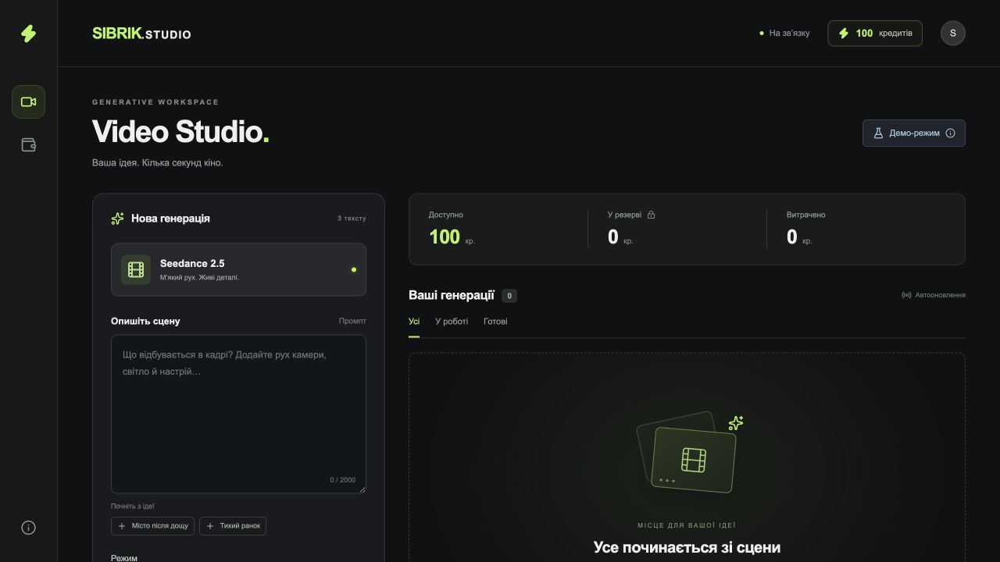
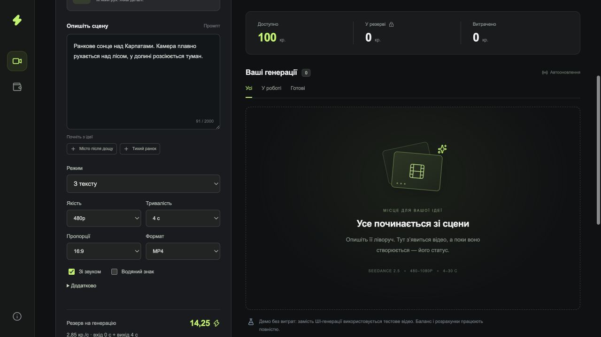
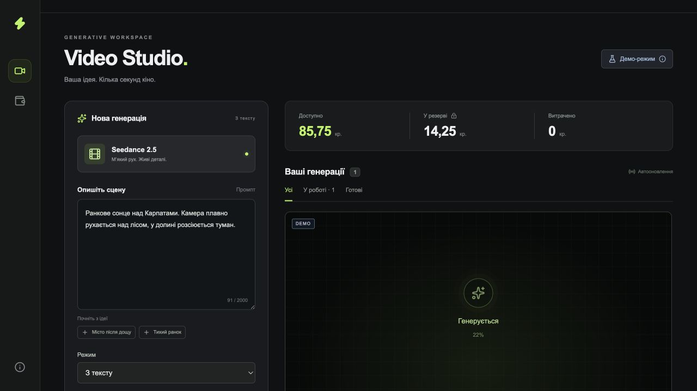
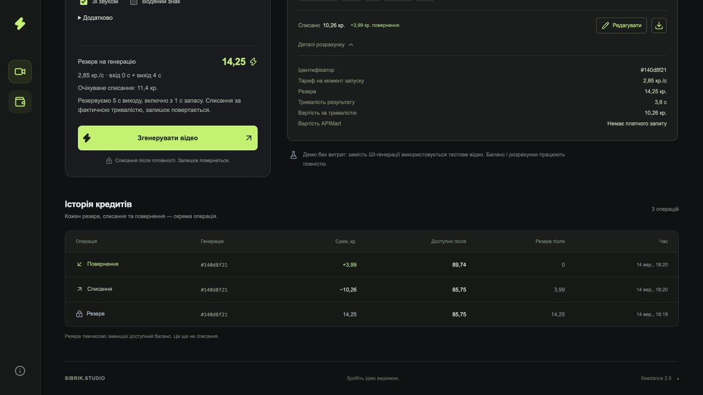

# Sibrik · Video Studio

Мінісервіс генерації та редагування відео на **React + TypeScript, Fastify, PostgreSQL 17 і ffprobe**. Провайдер — APIMart, модель — `seedance-2.5`. Інтерфейс об’єднує форму, бібліотеку референсів, баланс, резерв, результати та історію кредитів.

Реалізовано генерацію з тексту, референси, перший/останній кадри, Edit і Extend; підтримано 480p / 720p / 1080p, 4–30 секунд або автоматичну тривалість. Автоматичні перевірки: **78 тестів у 8 файлах**, TypeScript/Vite build і Prettier. Межі перевіреного описано в [звіті](docs/validation.md).

## Швидкий запуск

### Docker Compose

Потрібен запущений Docker із Compose v2 або новішим. У каталозі проєкту виконайте:

```sh
docker compose up --build
```

Відкрийте [localhost:3000](http://localhost:3000). Без `.env` працює **деморежим без витрат APIMart**. PostgreSQL, API та worker запускаються окремими сервісами; Node.js і ffprobe вже є в образі. Перше складання потребує інтернету для образів і залежностей.

Для фонового запуску додайте `-d`. Стан сервісів: `docker compose ps`; логи: `docker compose logs -f api worker`. `docker compose down` зупиняє сервіси, зберігаючи базу й відео в іменованих volumes. **`down -v` видаляє ці дані.** На іншому комп’ютері створюється нова база зі 100 кредитами; перезапуск наявної бази баланс не поповнює.

### Локально без Docker

Потрібні Node.js **22.12+** (перевірено на Node.js 24) та npm:

```sh
npm ci
npm run dev
```

Відкрийте [127.0.0.1:5173](http://127.0.0.1:5173). Команда запускає власний PostgreSQL на `54329`, API на `3000`, callback listener на `3001` і Vite на `5173`. База зберігається в `.local/postgres`, файли — у `storage`. Системні служби не встановлюються; Ctrl+C зупиняє процеси зі збереженням даних. Запускайте від звичайного користувача, не root.

Якщо маєте PostgreSQL, задайте `DATABASE_URL` у `.env`: вбудована база тоді не запускається. `LOCAL_PG_PORT` змінює її порт. Локальний запуск і Docker за замовчуванням використовують різні бази та сховища.

Для розробки всередині Docker з автоматичним оновленням:

```sh
docker compose -f compose.yaml -f compose.dev.yaml up --build
```

Інтерфейс буде на [localhost:5173](http://localhost:5173). Vite оновлює клієнт, `tsx watch` перезапускає API та worker після змін. Перед переходом між режимами зупиніть попередній запуск; після dev-режиму використайте `docker compose -f compose.yaml -f compose.dev.yaml down`, щоб прибрати також Vite-контейнер. Після зміни залежностей потрібне повторне складання з `--build`.

## Налаштування APIMart

```sh
cp .env.example .env
```

Для реальної генерації змініть у `.env`:

```dotenv
PROVIDER_MODE=apimart
APIMART_API_KEY=your_private_key
```

Збережіть файл і перезапустіть застосунок; для Docker — `docker compose up -d --build`. У режимі `apimart` порожній ключ зупиняє запуск. Цей режим витрачає кошти APIMart; кредити студії — окремий внутрішній облік. Для перевірки за ТЗ достатньо **480p та 4–5 секунд**.

Основні змінні описані в [.env.example](.env.example):

| Змінна                                   | Призначення                                                                                              |
| ---------------------------------------- | -------------------------------------------------------------------------------------------------------- |
| `PROVIDER_MODE`                          | `mock` для демо або `apimart` для реального API                                                          |
| `APIMART_API_KEY`                        | Приватний ключ, потрібний лише в режимі `apimart`                                                        |
| `DATABASE_URL`                           | Власна PostgreSQL; `npm run dev` може створити базу автоматично, Compose задає адресу свого сервісу `db` |
| `MEDIA_BASE_URL`                         | Публічний HTTPS-origin для передавання локальних відео/аудіо провайдеру                                  |
| `WEBHOOK_BASE_URL`                       | Публічний HTTPS-origin для callback; порожнє значення залишає polling                                    |
| `PORT` / `CALLBACK_PORT`                 | Порти студії та callback listener, типово `3000` / `3001`                                                |
| `WEB_PORT`                               | Опублікований порт Vite в Docker dev, типово `5173`                                                      |
| `INITIAL_CREDITS` / `CREDITS_PER_SECOND` | Початкові баланс і ставка **для нової бази**, типово `100` / `2.85`                                      |
| `JOB_TIMEOUT_SECONDS`                    | Загальний час очікування задачі, типово `1200` секунд                                                    |

`.env`, локальна база, згенеровані файли та логи виключені з Git. Зміна `INITIAL_CREDITS` не поповнює наявний баланс. Тарифи зберігаються в `models`, а створена задача має їхній незмінний знімок. `npm start` потребує попереднього `npm run build`, доступної PostgreSQL та ffprobe; автоматичне середовище готує саме `npm run dev`.

## Референси, Edit і webhook

Завантажте файл, імпортуйте пряме HTTPS-посилання або виберіть раніше підготовлений референс із бібліотеки. Сервер перевіряє формат і тривалість, кешує вміст за SHA-256 та готує `asset://` у бібліотеці APIMart. Кнопка **«Редагувати»** на готовому ролику підставляє локальну копію як джерело Edit. Після введення інструкції окрема кнопка запускає нову задачу; оригінал залишається в історії.

Для локальних відео/аудіо потрібна доступна провайдеру HTTPS-адреса через `MEDIA_BASE_URL`. Один тунель на **порт 3001** може обслуговувати і медіафайли, і webhook. Порожній `WEBHOOK_BASE_URL` не заважає polling. Інструкції: [режими та референси](docs/modes.md), [Cloudflare Tunnel](docs/tunnel.md).

Callback зберігає сигнал у PostgreSQL і пробуджує worker. Остаточний статус, файл і вартість worker отримує авторизованим запитом до APIMart; тіло callback не використовується для списання. Якщо webhook увімкнено, polling залишається резервною перевіркою раз на 60 секунд. Окремий listener не має інтерфейсу, фінансових API чи SSE.

**SSE** передає зміни від нашого backend до браузера. PostgreSQL `LISTEN/NOTIFY` зв’язує API та worker після COMMIT. Клієнт перечитує стан після події, перепідключення й повернення до вкладки; додатково синхронізується кожні 15 секунд. Джерело істини — база, а не події SSE.

## Облік кредитів

Суми зберігаються цілими **milli-credits**: 1 кредит = 1000 одиниць. Тривалість вимірюється в мікросекундах; обчислення використовують BigInt з одним округленням угору до 0,001 кредиту. Початкові внутрішні ставки: 480p — 2,85; 720p — 5,70; 1080p — 11,40 кр./с. Це цінова політика студії, а не доларові тарифи APIMart.

1. `POST /api/estimate` перевіряє параметри й показує очікувану вартість та резерв. Записів у ledger немає.
2. `POST /api/jobs` повторює розрахунок на сервері. Одна транзакція блокує гаманець, перевіряє ключ ідемпотентності та баланс, створює задачу й операцію `hold`. Якщо кредитів недостатньо — HTTP 402 без створення задачі.
3. Worker завантажує результат локально й вимірює відеопотік через ffprobe; тривалість контейнера використовується лише як запасний варіант. `actual_time` провайдера не є тривалістю відео.
4. Одна транзакція проводить `settle` за перевіреною тривалістю та `release` залишку. Помилка або остаточний таймаут повертає весь резерв. Повторний результат не створює повторних операцій.

### Запас до резерву

Для заданої тривалості резервуємо **на 1 секунду виходу більше**: замовлення 4 с → резерв за 5 с. У запит APIMart передається саме `duration: 4`; очікувана вартість до запуску також розраховується за 4 с. Вхідне відео враховується за виміряною тривалістю без додаткового запасу. Зображення не додають вхідних секунд. Auto та Edit резервують до 30 секунд виходу.

Приклад: 4 с / 480p → очікувана вартість **11,4 кр.**, резерв **14,25 кр.**; результат 4,041667 с → списання **11,519 кр.**, повернення **2,731 кр.** Старі задачі зберігають початковий резерв та історію операцій.

Запас +1 с не є гарантією тривалості з боку провайдера. Обрана політика застосунку: фактична вартість розраховується повністю, але списання обмежене резервом; перевищення покриває студія. Це свідоме обмеження реалізації вимоги про списання за фактичною тривалістю.

```text
actual   = ceil((input_duration_us + actual_duration_us) × saved_rate_milli / 1_000_000)
charged  = min(actual, hold)
released = hold − charged
absorbed = actual − charged
```

Усі чотири значення зберігаються окремо й доступні в деталях задачі. Баланс не стає від’ємним. `cost` у USD та `credits_cost` APIMart — окремі nullable decimal-поля; вони не списуються з внутрішнього гаманця та не підміняються нулем, якщо провайдер їх не повернув.

## Архітектура та надійність

Провайдер підключається через `VideoProvider` (`submit → poll → result`). Новий адаптер і його реєстрація додаються в `providers/`; worker, фінансовий облік, HTTP та схема БД залишаються спільними. Референси й webhook — додаткові можливості адаптера. Покроково: [підключення іншого провайдера](docs/architecture.md#підключення-іншого-провайдера).

- Клієнт згруповано за функціями: `studio`, `generation`, `assets`, `billing`; сервер — `http`, `jobs`, `billing`, `assets`, `media`, `db`, `providers`. Межі відповідальності — в [architecture.md](docs/architecture.md).
- Черга працює в PostgreSQL через `FOR UPDATE SKIP LOCKED`. Lease на 120 секунд із продовженням кожні 20 секунд і fencing token захищають від застарілого worker. Мережеві запити виконуються поза транзакціями.
- Гаманець, задача та ledger змінюються атомарно; порядок блокувань — `users` → `jobs`. CHECK-обмеження й унікальність `(job_id, kind)` додатково захищають облік.
- Повторний запит браузера з тим самим `Idempotency-Key` повертає ту саму задачу. Провайдер отримує окремий стабільний ключ — збережений ID задачі. Заявлене APIMart вікно захисту становить 24 години; локальна фінансова ідемпотентність спирається на записи в БД і не має цього TTL. Реальний платний replay окремо не перевірявся.
- Втрата відповіді або неоднозначний 5xx під час POST переводить задачу в `submission_unknown`: автоматичного повторного платного запуску без provider id немає. Резерв утримується до загального дедлайну, потім повертається.
- Підтверджений 429 повторюється з backoff і `Retry-After`. Помилки GET повторюються до дедлайну; 400/401/402/403, асинхронний `failed` і остаточний таймаут завершують задачу з поверненням. Деталі — в [architecture.md](docs/architecture.md#помилки-та-повтори).
- Відео завантажується в тимчасовий файл, перевіряється й атомарно перейменовується. Статус `completed` з’являється після фінансового COMMIT. Локальний медіамаршрут підтримує byte ranges для плеєра.

## Перевірка та скриншоти

```sh
npm test
npm run build
npm run format:check
```

Тести створюють окремий тимчасовий PostgreSQL і сховище, не використовують робочу базу й не викликають платний APIMart. Звіт про автоматичні перевірки й демоцикл: [validation.md](docs/validation.md).

Чотири скриншоти українського інтерфейсу показують демоцикл із чинним резервом +1 с. У деморежимі використовується тестовий MP4 із кольоровою таблицею, а не ШІ-відео за промптом. Для замовлення 4 с файл має 3,6 с: резерв **14,25**, списання **10,26**, повернення **3,99**, залишок **89,74 кр.**

| Початковий баланс                                          | Оцінка до запуску                                                                    |
| ---------------------------------------------------------- | ------------------------------------------------------------------------------------ |
|  |  |

| Генерація та резерв                                                                 | Списання й повернення                                                            |
| ----------------------------------------------------------------------------------- | -------------------------------------------------------------------------------- |
|  |  |

## Межі реалізації

- Одна модель та один тестовий користувач без реєстрації, ролей і авторизації — за умовами ТЗ. Основний API доступний локально; сервіс не призначений для відкритого багатокористувацького розгортання.
- PostgreSQL одночасно є базою та чергою. Окремі Redis/BullMQ/Kafka, ORM і контейнер залежностей не потрібні для цього обсягу.
- Результати зберігаються на диску або в Docker volume. S3, квоти, автоматичне очищення старих файлів, метрики й алерти залишені за межами тестового сервісу.
- Немає автоматичного поповнення гаманця, адміністративного виправлення розрахунків і ручного зв’язування невідомого submit із provider id. Пізні зміни собівартості APIMart окремий планувальник не звіряє.
- API повертає останні 100 задач і 150 операцій; повної пагінації немає.
- Розмітка кадру — додаткове зображення з інструкцією, не окремий mask API. Точність зміни лише всередині виділення не гарантується.
- Інші якості та розширені параметри перевірено автоматично, але не всіма платними генераціями. Для економної перевірки за ТЗ рекомендовано 480p і короткі ролики.

## Що поліпшити в API провайдера

Варто уточнити контракт `Idempotency-Key` для одночасних запитів, зміни тіла, помилок та завершення 24-годинного вікна, а також додати пошук задачі за client request id для відновлення втраченої відповіді. Схема моделі має точно описувати дозволені якості, тривалості й залежності параметрів між режимами. Для webhook потрібна повна специфікація HMAC-підпису, стабільний event id та узгоджені формати GET/callback. Окремі поля оплачуваної тривалості й остаточної собівартості спростили б фінансову звірку; `actual_time` для цього непридатний. Також зручніше приймати повний `webhook_url` без автоматичного дописування `/callback`.

## Час

Орієнтовна оцінка загального часу роботи — **8 годин**. Розподіл нижче приблизний.

| Етап                                                  | Час         |
| ----------------------------------------------------- | ----------- |
| Розбір ТЗ, документації та контракту APIMart          | 30 хв       |
| Схема БД, оцінка, резерв, списання та ідемпотентність | 1 год 30 хв |
| Інтеграція APIMart, worker, polling і обробка помилок | 1 год 15 хв |
| React-інтерфейс, SSE, плеєр та історія операцій       | 1 год       |
| Референси, бібліотека асетів та Edit                  | 1 год       |
| Тунель, webhook і перевірка інтеграції                | 45 хв       |
| Автоматичні тести, виправлення та впорядкування коду  | 1 год 30 хв |
| Документація й скриншоти                              | 30 хв       |
| **Разом**                                             | **8 год**   |

Автоматичні перевірки та демоцикл виконувалися в ізольованому локальному середовищі.

## Джерела

- [Seedance 2.5: генерація та параметри](https://docs.apimart.ai/en/api-reference/videos/seedance-2-5/generation)
- [APIMart: статус задачі](https://docs.apimart.ai/en/api-reference/tasks/status)
- [APIMart: webhook](https://docs.apimart.ai/en/api-reference/tasks/webhook)
- [APIMart: завантаження зображень](https://docs.apimart.ai/en/api-reference/uploads/images)
- [APIMart: бібліотека асетів](https://docs.apimart.ai/en/api-reference/videos/seedance-2-0/private-avatar)
- [Cloudflare Quick Tunnels](https://developers.cloudflare.com/cloudflare-one/networks/connectors/cloudflare-tunnel/do-more-with-tunnels/trycloudflare/)
